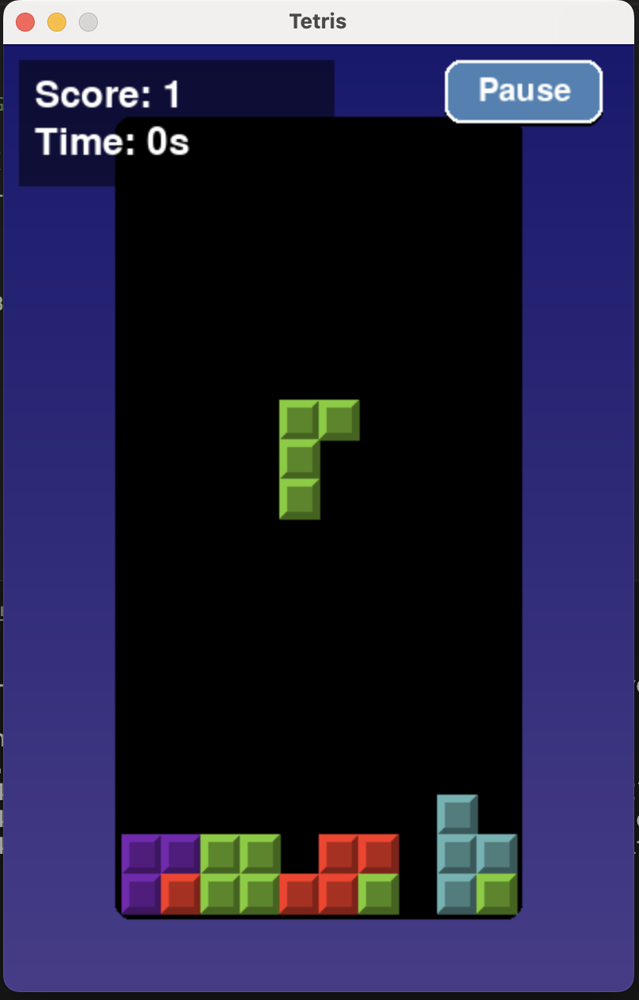

# 🎮 Cursor AI Tetris

Cursor AI를 활용해 테트리스 게임을 만들어봤어요!  
처음으로 만든 깃허브 프로젝트라서 더 애착이 가는 작업이에요 🩵

> 💡 깃과 깃허브를 배우면서 직접 프로젝트를 만들고  
> 커밋과 푸시, README 작성까지 직접 해봤습니다!

---

## 💻 사용한 기술

- Python 3.x  
- Pygame  
- Cursor AI  
- Git / GitHub

---

## 🖼 실행 화면



> 📸 위 이미지는 직접 만든 테트리스 게임을 실행한 모습입니다!

---

## ✨ 프로젝트 목표

- Cursor AI를 활용해 얼마나 빠르게 프로젝트를 만들 수 있을까?
- Git과 GitHub 사용을 익히고, 오픈소스에 익숙해지기
- 직접 만든 코드를 기록하고, 포트폴리오로 남기기

---

## 🛠 실행 방법

```bash
git clone https://github.com/minhee0830/tetris-cursor-ai.git
cd tetris-cursor-ai
python main.py
```
